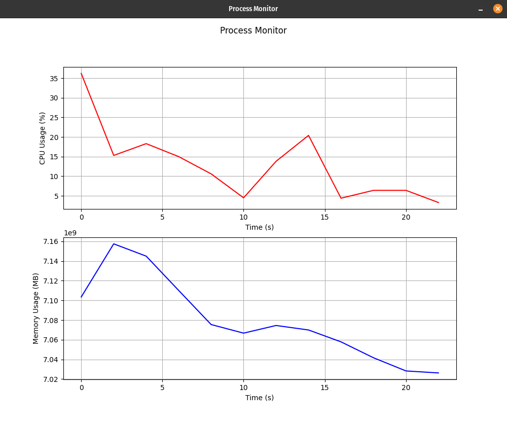

# Process Monitor

Este é um projeto simples de monitoramento de processos em tempo real que utiliza a biblioteca `psutil` para coletar dados de uso de CPU e memória, e `matplotlib` para plotar gráficos dinâmicos.



## Requisitos

Para executar este projeto, você precisará das seguintes bibliotecas Python:

- `psutil`
- `matplotlib`

Você pode instalar as dependências usando o `pip`:

```bash
pip install psutil matplotlib
```

## Como Executar

1. Clone o repositório ou copie o código para o seu ambiente local.
2. Execute o script Python:

```bash
python process_monitor.py
```

3. O monitoramento começará automaticamente, e dois gráficos serão exibidos:
   - Uso de CPU (%)
   - Uso de Memória (MB)

4. Para parar o monitoramento, pressione `Ctrl+C` no terminal.

## Funcionalidades

- **Monitoramento em Tempo Real**: O script coleta dados de uso de CPU e memória a cada intervalo de tempo especificado.
- **Gráficos Dinâmicos**: Os gráficos são atualizados em tempo real para refletir as mudanças no uso de CPU e memória.
- **Configuração Flexível**: Você pode ajustar o intervalo de coleta de dados e o número máximo de pontos exibidos nos gráficos.

## Personalização

- **Intervalo de Coleta**: Para alterar o intervalo de coleta de dados, modifique o parâmetro `interval` na função `process_monitor`. O valor padrão é 2 segundos.
- **Número de Pontos**: Para alterar o número máximo de pontos exibidos nos gráficos, modifique o parâmetro `max_points` na função `process_monitor`. O valor padrão é 30 pontos.

## Exemplo de Uso

```python
if __name__ == "__main__":
    process_monitor(interval=1, max_points=50)
```

Este exemplo configura o monitoramento para coletar dados a cada segundo e exibir até 50 pontos nos gráficos.

## Contribuição

Contribuições são bem-vindas! Sinta-se à vontade para abrir issues ou enviar pull requests para melhorar este projeto.

## Licença

Este projeto está licenciado sob a licença MIT. Veja o arquivo [LICENSE](LICENSE) para mais detalhes.